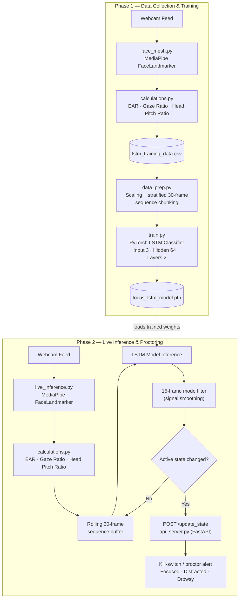

# Focus-CV 2.0: Temporal Intelligence Proctoring Engine

**Repository:** https://github.com/abhay-ugale-25/focus_detection_2.0

An advanced, headless computer vision pipeline that classifies a subject's cognitive state — **Focused**, **Distracted**, or **Drowsy** — in real time from a standard webcam feed.

Rather than reacting to single-frame anomalies, Focus-CV analyzes rolling 30-frame windows of facial metrics with a PyTorch LSTM, allowing it to understand *sustained behavioral patterns* over time. This produces a stable, low-noise signal suitable for a proctoring "kill-switch" — an automated alert that fires only when a genuine state change persists, rather than flickering on momentary blinks or head movements.

## Key Design Points

- **Deep temporal memory** — a 2-layer LSTM (input size 3, hidden size 64) consumes a sliding window of features instead of relying on brittle frame-by-frame thresholds.
- **Scale-invariant feature engineering:**
  - **EAR (Eye Aspect Ratio)** — detects blinks and prolonged eye closure.
  - **Gaze Ratio** — tracks left/right iris orientation.
  - **Bounded Head Pitch Ratio** — `upper_face_distance / total_face_height`, constrained between 0.0 and 1.0 so leaning in, sitting back, or shifting side-to-side doesn't falsely trigger a distance anomaly.
- **Signal smoothing (mode filter)** — a rolling voting buffer over the last 15 predictions debounces state transitions and eliminates micro-flickering.
- **Decoupled, privacy-first backend** — vision inference runs entirely on the local client (`live_inference.py`); only discrete state labels (not video or images) are broadcast via JSON to a local FastAPI microservice (`api_server.py`), avoiding the exposure of a live-hosted video UI.

## Flowchart



## Tech Stack

| Category | Technologies |
|---|---|
| **Deep Learning** | PyTorch, torchvision, scikit-learn |
| **Computer Vision** | MediaPipe FaceLandmarker, OpenCV |
| **Backend / API** | FastAPI, Uvicorn, Requests |
| **Data Processing** | Pandas, NumPy |

## Repository Structure

```
focus_detection_2.0/
├── main.py             # Entry point for the data-collection recorder (calls face_mesh.py)
├── face_mesh.py         # Webcam capture + MediaPipe landmarking + CSV logging for training data
├── calculations.py      # EAR, Gaze Ratio, and Head Pitch Ratio feature math
├── data_prep.py          # Feature scaling + stratified 30-frame sequence generation for the LSTM
├── train.py               # LSTM model definition and training loop (with early stopping)
├── live_inference.py       # Real-time inference client: webcam → features → LSTM → mode filter → API call
├── api_server.py            # FastAPI microservice exposing /update_state and /get_state
├── requirements.txt          # Python dependencies
└── .gitignore
```

## Usage

### Prerequisites

- Python 3.10+ and a working webcam.
- The MediaPipe **Face Landmarker** model asset, `face_landmarker.task`, placed in the project root (referenced by `face_mesh.py` and `live_inference.py`). It can be downloaded from MediaPipe's model hub.

Install dependencies:

```bash
pip install -r requirements.txt
```

### Phase 1 — Data Collection & Training

*(Skip this phase if you already have `focus_lstm_model.pth`.)*

1. **Record labeled training data:**

   ```bash
   python main.py
   ```

   With the webcam window active, press a number key to tag the incoming feature stream with a cognitive state:
   - `0` — Focused
   - `1` — Distracted
   - `2` — Drowsy

   Press `b` to set your baseline head-pitch ratio, and `q` to stop recording. Frame-level features are continuously appended to `lstm_training_data.csv`.

2. **Prepare and train the model:**

   ```bash
   python train.py
   ```

   `train.py` calls into `data_prep.py`, which scales the features and builds overlapping 30-frame sequences per class (preventing temporal leakage and class imbalance) before training the LSTM. The best-performing checkpoint (by validation loss, with early stopping) is saved to `focus_lstm_model.pth`.

### Phase 2 — Live Inference & Proctoring

The system runs as two decoupled processes — start both, in separate terminals.

1. **Start the kill-switch server:**

   ```bash
   python api_server.py
   ```

   Listens on `http://0.0.0.0:8000` for `POST /update_state` payloads and exposes `GET /get_state` for polling the current label.

2. **Launch the vision worker:**

   ```bash
   python live_inference.py
   ```

   - Sit upright and press `b` to lock in your baseline pitch ratio.
   - The worker fills a rolling 30-frame buffer, runs the LSTM once the buffer is full, applies the mode filter over the last 15 predictions, and fires an HTTP POST to the server only when the smoothed active state changes.
   - Press `q` to quit.

   Server-side, each incoming state is logged with a status icon:
   - ✅ Focused
   - ⚠️ Distracted
   - 🚨 Drowsy
